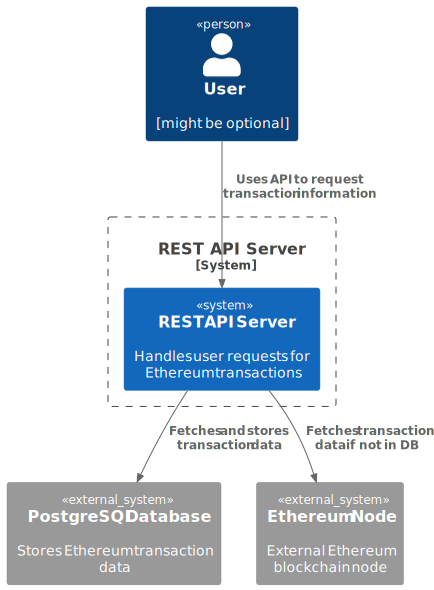
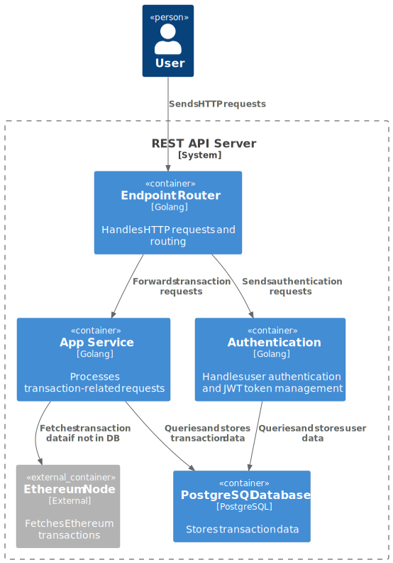
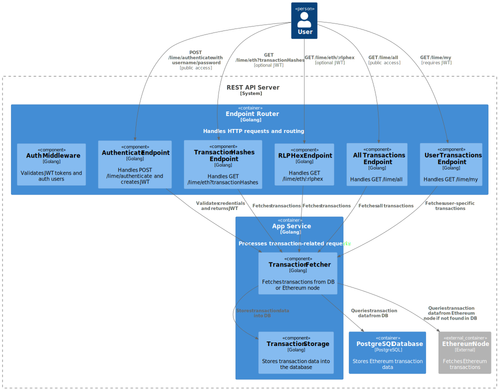

# The Ethereum Fetcher - REST Server Documentation

Short setup and documentation info.

## Configuration and environment

The server supports the following env variables:

- `API_PORT` - the port where the API is listening for requests
- `ETH_NODE_URL` - url to an ethereum node that is used for polling
- `DB_CONNECTION_URL` - url for connecting with your database. NOTE: you **might** need to use host.docker.internal
or your host IP as postgresql connection (instead of localhost)
- `JWT_SECRET` - the JWT secret used for the authentication part

Optionally you can provide or tweak the following variables:

- `LOG_LEVEL` - default level INFO
- `NODE_RATE_LIMIT_PER_SECOND` - default value for rate limiting of the ethereum node due
  to Infura restrictions, is 10

In order to make the development and testing easy [.env.example](.env.example) is provided.
Feel free to copy it as .env file and modify it according to your needs or make otherwise
those variables available in your environment, when running the server or the tests.

## Build and run instructions

For easy build, the server is made available via [Dockerfile](Dockerfile) and thus has the
pre-requirement of docker locally installed. 

```bash
git clone http://limechain-sjyoln@git.codesubmit.io/limechain/senior-the-ethereum-fetcher-bymuur 
# password is required to clone through this URL
cd senior-the-ethereum-fetcher-bymuur

# To build the tool, while you are still in the tool's source directory, you have to run the
# command bellow. Make sure your env is set.

docker build -t limeapi --build-arg API_PORT=${API_PORT:-8080} .

# To start the server use the command below:

docker run limeapi

# if you want to expose the port outside the container run it with the appropriate port like this:

docker run -p 8080:8080 limeapi

# In case you want to use the .env file, you can opt to run it with instead:
# docker run --env-file .env -p 8080:8080 limeapi
```

WARNING: In event that you don't have postgresql already up and running you can use the provided
[docker-compose.yml](docker-compose.yml) file to start both the server and postgresql (**recommended**).
Docker-compose by default **will load .env file**, so please make sure it up to date.

Note: Please keep in mind that postgresql in the compose file keeps the volume persistent (postgres_data:
/var/lib/postgresql/data),
so if you reuse the same database, for other purposes, please make sure the postgres database is clean.

```bash
# To build and run the services:
docker-compose up --build
```

## Linter & Tests

Running the linter (please check the --platform option bellow), in the project source directory:

```bash
docker run --rm --platform linux/arm64 -v $(pwd):/app -w /app golangci/golangci-lint:v1.60.3 golangci-lint run ./...
```

Running the test, in the project source directory:

```bash
go test ./... -count=1
```

Make sure, that the env are set, since DB_CONNECTION_URL is needed to satisfy the
"Your database can store and retrieve data" requirement, or the respective test suite will be skipped.

## Structure and Implementation

High-level diagrams overview are provided:







The REST API server provides a couple of endpoints:

- GET /lime/eth
- GET /lime/eth/{rlphex}
- GET /lime/all
- GET /lime/my
- POST /lime/authenticate

All of those a described in more details through [openapi.yaml](docs/openapi.yaml) and also provided
a [Postman collection](docs/ethereum_fetcher_api.postman_collection.json) with real examples.

The structure of the application follows basic SOLID principles and resembles core principles of DDD and Clean
Architecture.
To justify those claims, the application is designed and have the following treats:

- Layered design

    - Endpoint layer
        - Process the input arguments
        - Validate the input data
        - Calls the Application/service layer
        - Handle errors
        - Returns the result using dedicated response structure (i.e. different from the database or application).

      Aside from that, for JWT authentication, a special [wrapper/middleware](internal/server/auth.go) is responsible
      for handling security.

      Endpoint layer is only responsible for API/Client request/response - it doesn't have any business logic, network
      or database job.

    - Application/service layer
        - Orchestrates and acts as a glue between business logic, storage and operates with high-level functionality.

      Again, this layer doesn't handle domain specific task (like fetching ethereum transactions) or database storage.

    - Storage/database layer
        - The only purpose of the storage is to perform read/write operations and hides the database implementation
          details from other layers.

    - Network/node layer
        - This layer is closely related to the main business logic of the application - to source the Ethereum
          transaction data.

      The only reason to exist this layer it to handle network related operations.


- Dependency Injection

  Each layer, relies on interfaces and dependencies provided though their respective constructors.

  In order to sweeten the deal, this server uses dependency injection framework Dig, where the dependencies are
  registered in [di/setup.go](internal/di/setup.go)


- Interfaces

  Using interfaces, not only helps to create new implementations without modifying the existing code, but also
  make it possible to create mocks and make different layers, separately and easily testable. This approach cause
  different layers to be loosely coupled.

## Design choices and remarks

Since the requirement were very specific some of the design choices were predetermined.

- go-migrate

  There are a couple of ways to provide working database schemas/tables, either with separate pipeline
  that first migrate the database and then start the application or the application itself do the migration.

  Either ways have advantages/disadvantages. Running the migration within application, for one, give you
  the advantage and guarantee that it runs with correct schema, expected by the application.

  The migration of the database is handled by the [storage layer](internal/store/pg/setup.go) and happens immediately
  when the dependency is requested. All the migration files are provided as SQL up/down scripts and those
  provided as part of the executable in the [docker](Dockerfile) image.


- database first

  go-migrate relies on SQL files to set up the database, not on code or structure definition.
  In order to provide database first experience SQLBoiler package is used, which complements well go-migrate.

  The reason to pick database first approach is having better control over database generation, indices and
  overall transparency.

  Although SQLBoiler was used in many situations using raw SQL queries makes much more sense,
  since many of those ORMs don't support everything. For example, very useful UNNEST is not supported by those
  and requires extra effort and fallback to raw queries. Another disadvantage is performance that might
  come from poorly constructed queries (boil.DebugMode helps) or unneeded eager loading.

  For simpler queries working with SQLBoiler is easier and also provides tables and columns type safety
  (demonstrated in the code).


- Dig as DI

  This framework is reflection-based and works at runtime in opposite of Google's Wire that works through
  code generation. Although most of the time you can provide the dependencies manually - top to bottom,
  starting from main(), through constructors, for that task, the choice was made, for education purposes.


- API lack of pagination

  One thing that sore my eyes is lack of pagination, that expose the endpoints of DoS. Out of memory, etc.
  Aside from that the service might implement rate limiter - the same way Infura might enforce 10 req/s.

  Still, using 429 status code is also an option (i.e. fail-fast instead of throttling back and wait for the node).


- JWT

  Using JWT in opposition to database sessions is the way to go, in order to scale without having to check
  everytime the database for valid credentials or session.

  That is the reason, why for this task I used the "sub" claim to store the user ID, which later is accessible
  through request Context.
